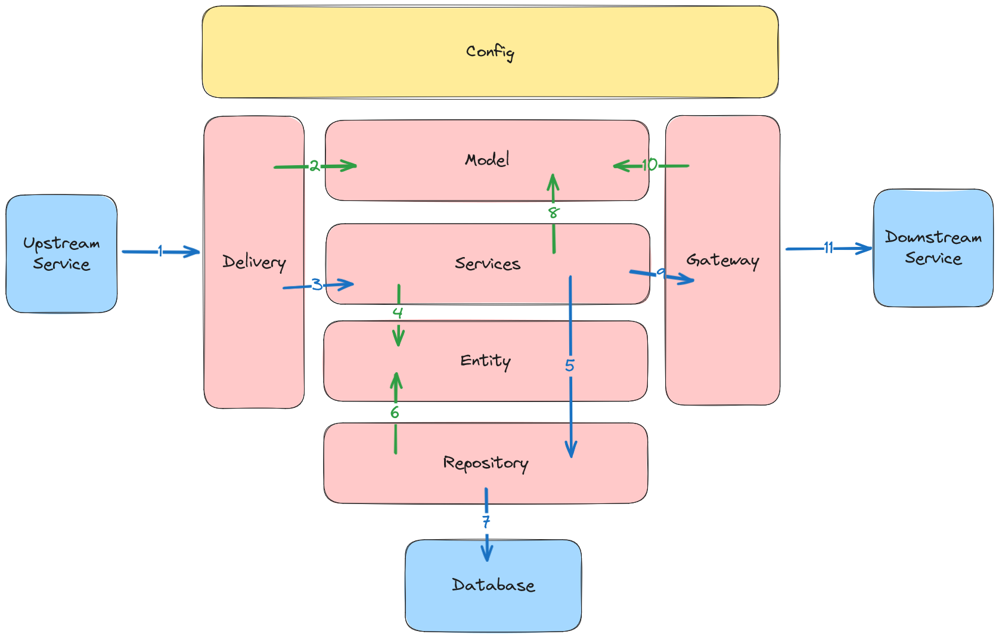

# Golang Clean Architecture Template

## Description

This is golang clean architecture template.

## Architecture



1. Delivery receives an HTTP request from an external system.
2. Delivery parses request data and constructs the necessary data model.
3. Delivery calls Service, passing along the constructed model data.
4. Service applies business logic, potentially creating or modifying entity data.
5. Service interacts with Repository to perform database operations, using the processed entity data.
6. Repository accesses the database and executes the necessary operations based on entity data.
7. Service formats the response model and sends it back to Delivery.
8. Delivery sends the HTTP response back to the external system.

## Tech Stack

- Golang : https://github.com/golang/go
- Postgres (Database) : https://github.com/go-gorm/postgres
- Apache Kafka : https://github.com/apache/kafka

## Framework & Library

- Gin (HTTP Framework) : https://github.com/gin-gonic/gin
- GORM (ORM) : https://github.com/go-gorm/gorm
- Viper (Configuration) : https://github.com/spf13/viper
- Go Playground Validator (Validation) : https://github.com/go-playground/validator


## API Spec

All API Spec is in [swagger documentation](./docs/swagger.yaml)


## Run Application

### Run web server

```bash
go run cmd/web/main.go
```
### Docker compose

```bash
docker compose up -d
```

### Access Docs

after running:
- http://localhost:9004/swagger/index.html